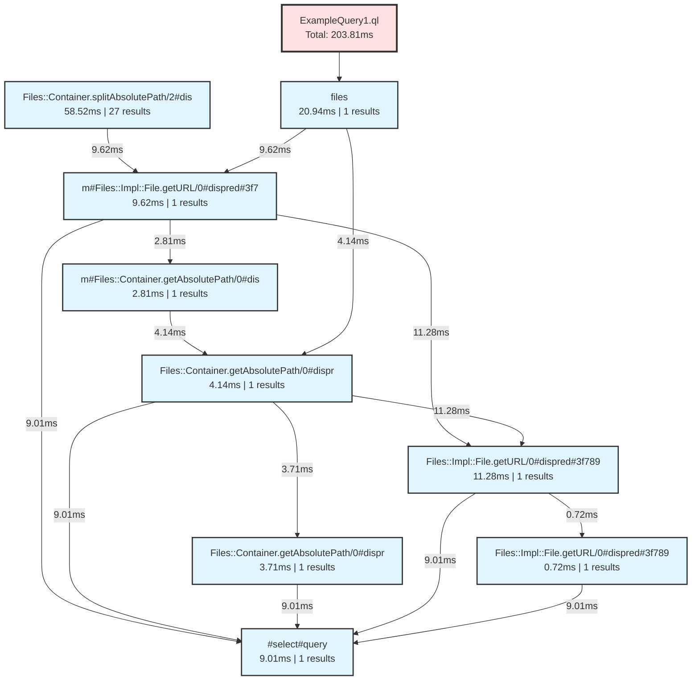

```mermaid
graph TD

  QUERY["ExampleQuery1.ql<br/>Total: 203.81ms"]

  P3["files<br/>20.94ms | 1 results"]
  P5["Files::Container.splitAbsolutePath/2#dis<br/>58.52ms | 27 results"]
  P9["m#Files::Impl::File.getURL/0#dispred#3f7<br/>9.62ms | 1 results"]
  P13["m#Files::Container.getAbsolutePath/0#dis<br/>2.81ms | 1 results"]
  P17["Files::Container.getAbsolutePath/0#dispr<br/>4.14ms | 1 results"]
  P21["Files::Impl::File.getURL/0#dispred#3f789<br/>11.28ms | 1 results"]
  P25["Files::Impl::File.getURL/0#dispred#3f789<br/>0.72ms | 1 results"]
  P29["Files::Container.getAbsolutePath/0#dispr<br/>3.71ms | 1 results"]
  P33["#select#query<br/>9.01ms | 1 results"]

  QUERY --> P3

  P5 -->|"9.62ms"| P9
  P3 -->|"9.62ms"| P9
  P9 -->|"2.81ms"| P13
  P13 -->|"4.14ms"| P17
  P3 -->|"4.14ms"| P17
  P9 -->|"11.28ms"| P21
  P17 -->|"11.28ms"| P21
  P21 -->|"0.72ms"| P25
  P17 -->|"3.71ms"| P29
  P9 -->|"9.01ms"| P33
  P17 -->|"9.01ms"| P33
  P29 -->|"9.01ms"| P33
  P21 -->|"9.01ms"| P33
  P25 -->|"9.01ms"| P33

  classDef default fill:#e1f5ff,stroke:#333,stroke-width:2px
  classDef query fill:#ffe1e1,stroke:#333,stroke-width:3px
  class QUERY query
```