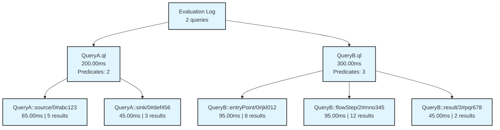

```mermaid
graph TD

  ROOT["Evaluation Log<br/>2 queries"]

  Q0["QueryA.ql<br/>200.00ms<br/>Predicates: 2"]
  ROOT --> Q0
  Q0P0["QueryA::source/0#abc123<br/>65.00ms | 5 results"]
  Q0 --> Q0P0
  Q0P1["QueryA::sink/0#def456<br/>45.00ms | 3 results"]
  Q0 --> Q0P1

  Q1["QueryB.ql<br/>300.00ms<br/>Predicates: 3"]
  ROOT --> Q1
  Q1P0["QueryB::entryPoint/0#jkl012<br/>95.00ms | 8 results"]
  Q1 --> Q1P0
  Q1P1["QueryB::flowStep/2#mno345<br/>95.00ms | 12 results"]
  Q1 --> Q1P1
  Q1P2["QueryB::result/3#pqr678<br/>45.00ms | 2 results"]
  Q1 --> Q1P2


  classDef default fill:#e1f5ff,stroke:#333,stroke-width:2px
  classDef query fill:#ffe1e1,stroke:#333,stroke-width:3px
  class QUERY query
```