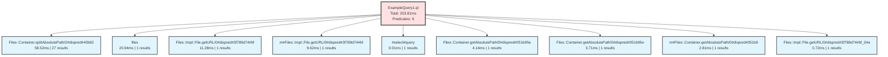

```mermaid
graph TD

  QUERY["ExampleQuery1.ql<br/>Total: 203.81ms<br/>Predicates: 9"]

  P0["Files::Container.splitAbsolutePath/2#dispred#43b82<br/>58.52ms | 27 results"]
  P1["files<br/>20.94ms | 1 results"]
  P2["Files::Impl::File.getURL/0#dispred#3f789d74#bf<br/>11.28ms | 1 results"]
  P3["m#Files::Impl::File.getURL/0#dispred#3f789d74#bf<br/>9.62ms | 1 results"]
  P4["#select#query<br/>9.01ms | 1 results"]
  P5["Files::Container.getAbsolutePath/0#dispred#051b95e<br/>4.14ms | 1 results"]
  P6["Files::Container.getAbsolutePath/0#dispred#051b95e<br/>3.71ms | 1 results"]
  P7["m#Files::Container.getAbsolutePath/0#dispred#051b9<br/>2.81ms | 1 results"]
  P8["Files::Impl::File.getURL/0#dispred#3f789d74#bf_0#a<br/>0.72ms | 1 results"]

  QUERY --> P0
  QUERY --> P1
  QUERY --> P2
  QUERY --> P3
  QUERY --> P4
  QUERY --> P5
  QUERY --> P6
  QUERY --> P7
  QUERY --> P8

  classDef default fill:#e1f5ff,stroke:#333,stroke-width:2px
  classDef query fill:#ffe1e1,stroke:#333,stroke-width:3px
  class QUERY query
```